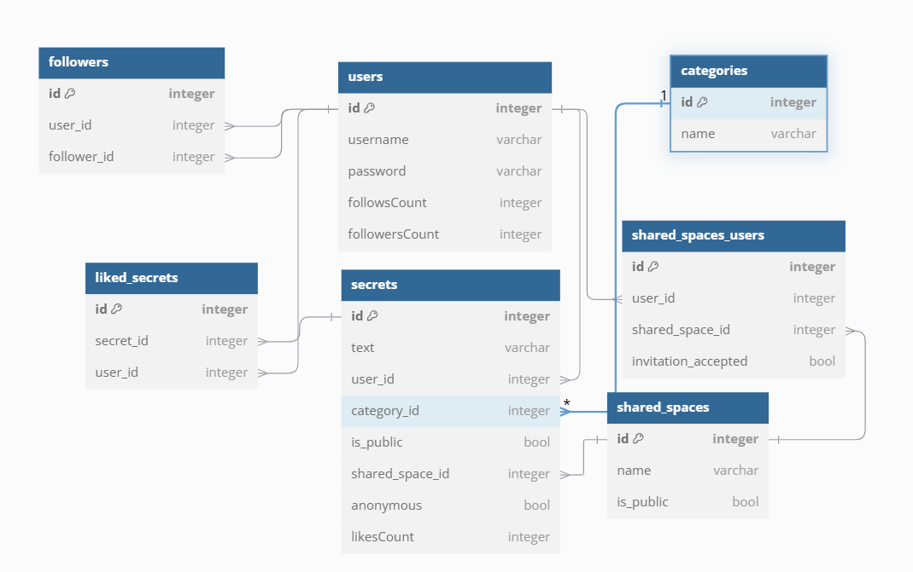

## Comment installer le projet

### Créer un environnement virtuel en Python

*Le venv est utilisé pour installer les dépendances du projet localement et non globalement sur le système*

```py
python -m venv venv
```

### Activer l'environnement virtuel

```py
venv/Scripts/activate
```

### Installer les dépendances du projet

*Le fichier requirements.txt est utilisé pour lister les dépendances à installer avec les versions adéquat*

```py
pip install -r requirements.txt
```

### Docker

*Nous avons utilisé Docker afin de rendre l'installation plus simple maisutilisé PostreSQL fonctionnera aussi bien*

#### Créer un fichier .env à la racine du projet

```env
DATABASE_USER=your_user
DATABASE_PASSWORD=your_password
DATABASE_NAME=sekret
```

#### Démarrer le conteneur Docker de PostgreSQL

```bash
docker compose --env-file .env up -d
```

## Comment lancer le projet

*Grâce aux environnements virtuels, nous pouvons lancer le projet via la commande suivante*

```bash
fastapi dev .\main.py
```

## Comment tester le projet

*Les tests unitaires sont écrits dans le dossier tests et peuvent être lancés via la commande suivante*

```bash
python -m unittest discover -s tests
```
or
```bash
python3 -m unittest discover -s tests
```

## Schema de la base de données

